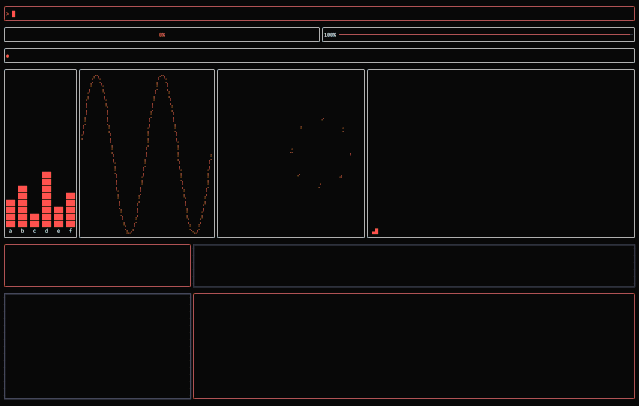

# 🎞️ animate

Animation Library for Rust.



## Features

- **Lightweight**: Zero dependencies by default.
- **Ergonomic**: Macro-driven API with minimal boilerplate.
- **Extensible**: Many built-in types with support for custom interpolators.
- **Animation modes**: `#[once]`, `#[cycle]`, and `#[alternate]`.
- **Easing**: Built-in and custom easing functions.
- **Ratatui-friendly**: Interpolators for ratatui types, gated behind the `ratatui` feature flag.

## Installation

```sh
cargo add animate
```

## Getting started

Add `#[animate]` to a struct and mark the fields you want to animate:

```rust
#[animate]
pub struct MyWidget {
    #[once(duration = 300)]
    progress: f64,

    #[cycle(duration = 400, easing = cubic_in)]
    color: Color,

    #[alternate(duration = 500, easing = quad_in_out)]
    status: String,
}
```

By default the macro generates an update method named `animate`. It must be called at the top of your struct's render method.

```rust
#[animate]
pub struct MyWidget { ... }

impl MyWidget {
    pub fn draw(&mut self, frame: &mut Frame) {
        self.animate();

        // rest of your code
    }
}
```

If the name conflicts with an existing method, rename it:

```rust
#[animate(update = "update_animations")]
pub struct MyWidget { ... }
```

Next, place `animate::tick()` **before** your struct's update call at the start of each frame:

```rust
let mut widget = MyWidget::new(...);

loop {
    animate::tick(tickrate);
    terminal.draw(|frame| {
        widget.draw(frame);
    })?;
}
```

Use `get()` to read and `set()` to write animated fields.

## Minimal example

```rust
use animate::animate;
use std::{io::{stdout, Write}, thread, time::Duration};

#[animate]
struct Counter {
    #[once(duration = 400)]
    value: u32,
}

fn main() -> std::io::Result<()> {
    let mut c = Counter::new(0);

    loop {
        animate::tick(8);  // advance global frame time by frame delta (ms)
        c.animate();       // update all animated fields

        let v = *c.value;
        if v == 0 {
            c.value.set(100);
        }

        print!("\rCounter value: {v}");
        stdout().flush()?;

        if v == 100 {
            break;
        }

        thread::sleep(Duration::from_millis(8));
    }

    Ok(())
}
```

## Animation modes

| Attribute      | Behaviour                                           |
|----------------|-----------------------------------------------------|
| `#[once]`      | Animates to target once, then holds.                |
| `#[cycle]`     | Loops continuously from start to target.            |
| `#[alternate]` | Ping-pongs back and forth between start and target. |

## Fields

All mode attributes accept the same options:

```rust
#[once(duration = 300, easing = quad_in_out, interp = my_interp_fn)]
```

| Option     | Type       | Default             | Description                                      |
|------------|------------|---------------------|--------------------------------------------------|
| `duration` | `u64` (ms) | `0`                 | Animation duration in milliseconds.              |
| `easing`   | path       | `linear`            | Easing function (`fn(f64) -> f64`).              |
| `interp`   | path       | `<T as Lerp>::lerp` | Interpolation function (`fn(&T, &T, f64) -> T`). |

## Built-in easing functions

`linear`, `quad_in`, `quad_out`, `quad_in_out`,
`cubic_in`, `cubic_out`, `cubic_in_out`

## Custom types

Implement `Lerp` for any type:

```rust
impl animate::Lerp for MyColor {
    fn lerp(start: &Self, end: &Self, t: f64) -> Self {
        MyColor {
            r: u8::lerp(&start.r, &end.r, t),
            g: u8::lerp(&start.g, &end.g, t),
            b: u8::lerp(&start.b, &end.b, t),
        }
    }
}
```