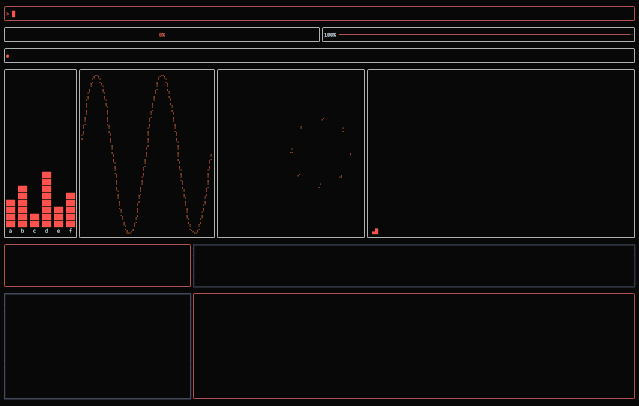

# 🎞️ animate

Lightweight Rust animation library with tweening and physics-based springs



## Features

- **Lightweight**: Zero dependencies by default.
- **Ergonomic**: Provides an optional global clock and a macro-driven API for minimal boilerplate.
- **Extensible**: Many built-in types with support for custom interpolators.
- **Repeat modes**: `Once`, `Times(n)`, `Infinite`, with optional alternating.
- **Easing**: Built-in and custom easing functions.
- **Physics-based**: Supports spring animations.
- **Ratatui-friendly**: Interpolators for ratatui types, gated behind the `ratatui` feature flag.

## Installation

```sh
cargo add animate
```

## Getting started

Animations are ordinary values you store in your own structs, driven by a `Clock`:

```rust
use std::time::Duration;
use animate::{Clock, Tween};

struct MyWidget {
    field: Tween<f32>,
}

impl MyWidget {
    fn new() -> Self {
        let field = Tween::new(0.0f32)
            .duration(Duration::from_millis(300))
            .easing(animate::easing::quad_out);

        Self {
            field
        }
    }

    fn update(&mut self, clock: &mut Clock, target: f32) {
        // animate towards target
        self.field.to(target);

        let time = clock.advance(Duration::from_millis(16));
        let activity = self.field.advance(time);

        // deref to get the current value
        println!("{}", *progress);
    }
}
```

## Macros

```rust
use animate::animate;

#[animate]
pub struct MyWidget {
    #[tween(duration = 300)]
    progress: f32,

    #[tween(repeat = "infinite", duration = 400, easing = cubic_in)]
    color: Color,

    #[tween(duration = 500, easing = quad_in_out, alternate)]
    status: String,
}
```

The macro generates a method named `advance` and returns the merged `Activity` of every animated field. It must be called at the top of your struct's render method.

```rust
impl MyWidget {
    pub fn draw(&mut self, frame: &mut Frame) {
        let activity = self.advance(...);
        // rest of your code
    }
}
```

If the name conflicts with an existing method, rename it:

```rust
#[animate(update = "update_animations")]
pub struct MyWidget { ... }
```

## Minimal example

```rust
use animate::{Clock, animate};
use std::{
    io::{stdout, Write},
    thread,
    time::Duration,
};

#[animate]
struct Counter {
    #[tween(duration = 400)]
    value: u32,
}

fn main() -> std::io::Result<()> {
    let mut c = Counter::new(0);
    let mut clock = Clock::new();

    loop {
        let time = clock.advance(Duration::from_millis(8));
        let activity = c.advance(time);

        let v = *c.value;
        if v == 0 {
            c.value.to(100);
        }

        print!("\rCounter value: {v}");
        stdout().flush()?;

        if activity.finished() {
            break;
        }

        thread::sleep(Duration::from_millis(8));
    }

    Ok(())
}
```

## Repeat modes

| Mode                | Behaviour                                           |
|---------------------|-----------------------------------------------------|
| `Repeat::Once`      | Animates to target once, then holds.                |
| `Repeat::Times(n)`  | Plays `n` cycles, then holds.                       |
| `Repeat::Infinite`  | Loops continuously from start to target.            |

Can be combined with`.alternate(true)` to reverse direction every other
cycle.

## Tween fields

```rust
#[tween(duration = 300, delay = 100, easing = quad_in_out, repeat = "infinite", alternate)]
```

| Option     | Type       | Default   | Description                          |
|------------|------------|-----------|--------------------------------------|
| `duration` | `u64` (ms) | `300`     | Animation duration in milliseconds.  |
| `delay`    | `u64` (ms) | `0`       | Delay before each run.               |
| `easing`   | path       | `linear`  | Easing function (`fn(f32) -> f32`).  |
| `repeat`   | `"once"` / `"infinite"` / integer | `"once"` | Cycle behaviour.          |
| `alternate`| flag       | off       | Reverse every other cycle.           |

## Built-in easing functions

`linear`, `quad_in`, `quad_out`, `quad_in_out`,
`cubic_in`, `cubic_out`, `cubic_in_out`

## Spring animations

In addition to time-based animations, or `Tween`s, animate also supports physics-based spring animations.

```rust
#[animate]
pub struct Widget {
    #[spring(stiffness = 200.0, damping = 20.0, mass = 1.0)]
    x: f64,
}
```

## Custom types

Implement `Interpolate` to tween a type, and/or `Integrate` to spring it:

```rust
struct MyColor { r: u8, g: u8, b: u8 }

impl animate::Interpolate for MyColor {
    fn lerp(start: &Self, end: &Self, t: f32) -> Self {
        MyColor {
            r: u8::lerp(&start.r, &end.r, t),
            g: u8::lerp(&start.g, &end.g, t),
            b: u8::lerp(&start.b, &end.b, t),
        }
    }
}
```

## Global clock

`animate` optionally provides a global frame-time:

```rust
loop {
    animate::global_clock::tick(16);
    terminal.draw(|frame| app.draw(frame))?;
}
```
